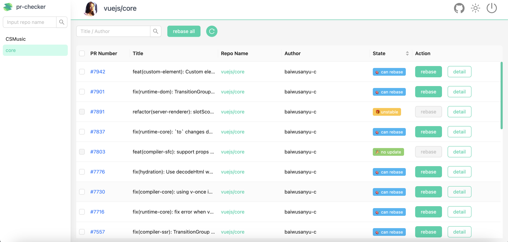
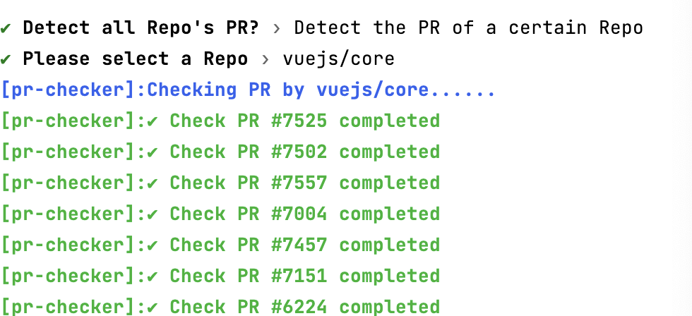
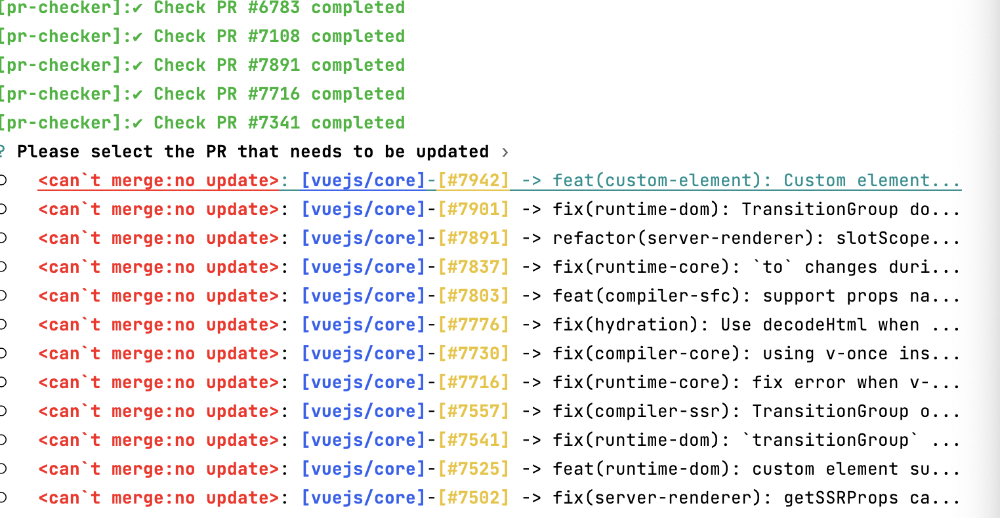
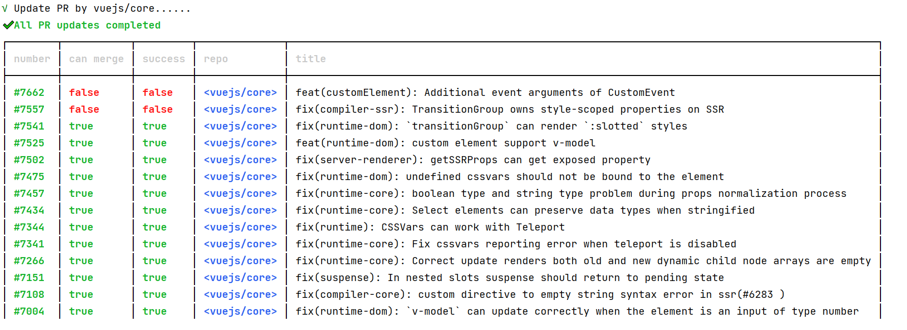

# 🚀 PR-Checker

检测您所提交的 `PR` 并自动更新,它包含一个浏览器扩展与 `cli`

[English](https://github.com/baiwusanyu-c/pr-checker/blob/master/README.md) | 中文

## 特性

- ⚡️通过指令按照仓库检测您所提交的 `PR` 是否需要更新
- ☘️通过指令按照仓库选择更新您所提交的 `PR`
- 🔥️通过指令一键检测您账号下所有 `PR` 是否需要更新
- 🌷通过指令选择更新您账号下所有 `PR`

## 浏览器扩展使用

它的使用非常简单，你只需要安装即可

## 浏览器扩展快照




## CLI 使用

#### 1.安装

```` shell
pnpm install pr-checker --global
````
或
```` shell
npm install pr-checker --global
````
或
```` shell
yarn install pr-checker --global
````

#### 2.运行命令 `pr-checker`

* 设置你的 GitHub Token  
> 首次使用请设置 GitHub Token
```bash
pr-checker -t #<GH_TOKEN> // set github token
```

* 首次使用请设置 GitHub用户名。
> v1.1.1 版本以及更低的版本首次使用需要设置 GitHub 用户名  
v1.1.1以上版本会根据 GitHub Token 自动设置用户名
```bash
pr-checker -u #<GH_USERNAME> // set github username
```

* 运行 run 命令来检查你的 pr
```` shell
pr-checker run
````

#### 3. 选择类型

```` shell
? Detect all Repo's PR? » - Use arrow-keys. Return to submit.
>   All Repo // 更新所有仓库的 PR
    Detect the PR of a certain Repo // 选择一个仓库的 PR

````

#### 4. 选择你仓库 (如果你选择了 `Detect the PR of a certain Repo`)

```` shell
? Please select a Repo » - Use arrow-keys. Return to submit.
>   baiwusanyu-c/pr-checker
    vuejs/core
    mistjs/vite-plugin-copy-files

````
之后会开始对 `PR` 进行检测，是否能够进行更新
```shell
✔ Please select a Repo › vuejs/core
[pr-checker]:Checking PR by vuejs/core......
[pr-checker]:✔ Check PR #7525 completed
[pr-checker]:✔ Check PR #7502 completed
[pr-checker]:✔ Check PR #7557 completed
[pr-checker]:✔ Check PR #7004 completed
[pr-checker]:✔ Check PR #7457 completed
```

#### 5. 选择 `PR` 进行更新

```` shell
? Please select the PR that needs to be updated › 
◯   <can`t merge:no update>: [vuejs/core]-[#7942] -> feat(custom-element): Custom element...
◯   <can`t merge:no update>: [vuejs/core]-[#7901] -> fix(runtime-dom): TransitionGroup do...
◯   <can`t merge:no update>: [vuejs/core]-[#7891] -> refactor(server-renderer): slotScope...
◯   <can`t merge:no update>: [vuejs/core]-[#7837] -> fix(runtime-core): `to` changes duri...
◯   <can`t merge:no update>: [vuejs/core]-[#7803] -> feat(compiler-sfc): support props na...
◯   <can`t merge:no update>: [vuejs/core]-[#7776] -> fix(hydration): Use decodeHtml when ...
◯   <can`t merge:no update>: [vuejs/core]-[#7730] -> fix(compiler-core): using v-once ins...
◯   <can`t merge:no update>: [vuejs/core]-[#7716] -> fix(runtime-core): fix error when v-...
◯   <can`t merge:no update>: [vuejs/core]-[#7557] -> fix(compiler-ssr): TransitionGroup o...
◯   <can`t merge:no update>: [vuejs/core]-[#7541] -> fix(runtime-dom): `transitionGroup` ...
◯   <can`t merge:no update>: [vuejs/core]-[#7525] -> feat(runtime-dom): custom element su...
◯   <can`t merge:no update>: [vuejs/core]-[#7502] -> fix(server-renderer): getSSRProps ca...
◯   <can`t merge:no update>: [vuejs/core]-[#7475] -> fix(runtime-dom): undefined cssvars ...

````
最后更新完成，不符合更新条件的（例如存在代码冲突），会被认定为无法自动更新。
```shell
√ Update PR by vuejs/core......
✔ All PR updates completed
┌────────┬───────────┬─────────┬──────────────┬────────────────────────────────────────────────────────────────────────────────────────────────┐    
│ number │ can merge │ success │ repo         │ title                                                                                          │     
├────────┼───────────┼─────────┼──────────────┼────────────────────────────────────────────────────────────────────────────────────────────────┤     
│ #7662  │ false     │ false   │ <vuejs/core> │ feat(customElement): Additional event arguments of CustomEvent                                 │     
│ #7557  │ false     │ false   │ <vuejs/core> │ fix(compiler-ssr): TransitionGroup owns style-scoped properties on SSR                         │     
│ #7541  │ true      │ true    │ <vuejs/core> │ fix(runtime-dom): `transitionGroup` can render `:slotted` styles                               │     
│ #7525  │ true      │ true    │ <vuejs/core> │ feat(runtime-dom): custom element support v-model                                              │     
│ #7502  │ true      │ true    │ <vuejs/core> │ fix(server-renderer): getSSRProps can get exposed property                                     │     
│ #7475  │ true      │ true    │ <vuejs/core> │ fix(runtime-dom): undefined cssvars should not be bound to the element                         │     
│ #7457  │ true      │ true    │ <vuejs/core> │ fix(runtime-core): boolean type and string type problem during props normalization process     │     
│ #7434  │ true      │ true    │ <vuejs/core> │ fix(runtime-core): Select elements can preserve data types when stringified                    │     
│ #7344  │ true      │ true    │ <vuejs/core> │ fix(runtime): CSSVars can work with Teleport                                                   │     
│ #7341  │ true      │ true    │ <vuejs/core> │ fix(runtime-core): Fix cssvars reporting error when teleport is disabled                       │     
│ #7266  │ true      │ true    │ <vuejs/core> │ fix(runtime-core): Correct update renders both old and new dynamic child node arrays are empty │     
│ #7151  │ true      │ true    │ <vuejs/core> │ fix(suspense): In nested slots suspense should return to pending state                         │     
│ #7108  │ true      │ true    │ <vuejs/core> │ fix(compiler-core): custom directive to empty string syntax error in ssr(#6283 )               │     
│ #7004  │ true      │ true    │ <vuejs/core> │ fix(runtime-dom): `v-model` can update correctly when the element is an input of type number   │     
│ #6783  │ true      │ true    │ <vuejs/core> │ fix(runtime-core):transition missing root node warning used in prod #6752                      │     
│ #6224  │ true      │ true    │ <vuejs/core> │ feat(runtime-core): Update rendering error caused by shallow copy #6221                        │     
└────────┴───────────┴─────────┴──────────────┴────────────────────────────────────────────────────────────────────────────────────────────────┘  
```
### 其他
#### -v ｜ --version
显示版本信息

```` shell
pr-checker -v
````

#### -h ｜ --help
显示帮助信息

```` shell
pr-checker -h
````

#### -m ｜ --mode
使用 rebase 模式 或者 merge 模式 , 默认值是 rebase 模式    

> 在 `rebase` 模式中， 你可以选择仓库或这直接对所有你所提交的 `pr` 进行 `rebase` 操作  
它将调用 `/repos/${repoName}/pulls/${prNumber}/update-branch`.  

>在 `merge` 模式中，它是一个试验性的功能，你可以对你所拥有的仓库（`fork` 的仓库除外）进行 `merge` 操作
它将调用 `/repos/${repoName}/pulls/${prNumber}/merge`.
一个典型的引用场景就是批量处理`dependabot`的 `pr`, 
另外由于 github api 不支持将 pr 导入到 merge queue，所以我使用了队列进行轮训请求，因此并不能保证所有 pr 
都能够被成功 merge

```` shell
pr-checker run -m merge ｜ rebase
````

## 快照




## 鸣谢
* [cpr](https://github.com/edison1105/cpr)
