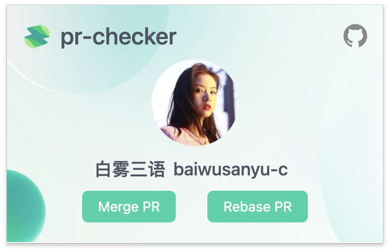
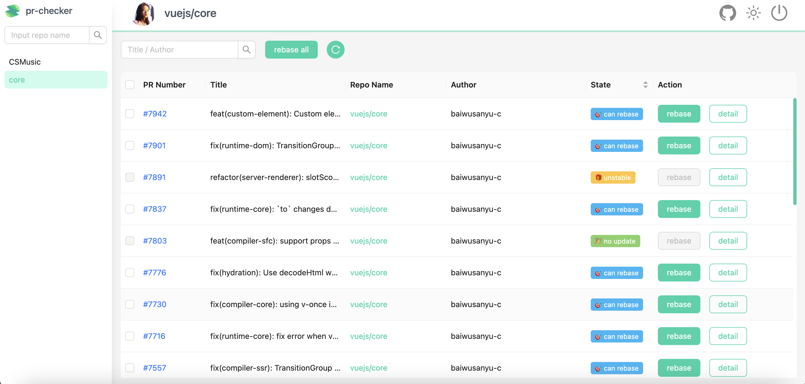
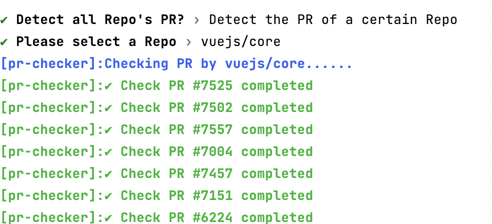
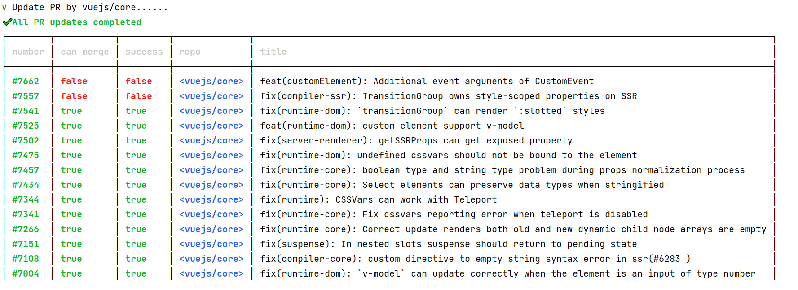

# 🚀 PR-Checker

Detect and update your Pull Requests in batches, it contains a browser extension with `cli`

English | [中文](https://github.com/baiwusanyu-c/pr-checker/blob/master/README.ZH-CN.md)
## Features

- ⚡️Check whether the `PR` submitted by you needs to be updated according to the warehouse
- ☘ Choose to update your submitted `PR` by command according to the repository
- 🔥️ Check whether all `PR` under your account need to be updated with one click of the command
- 🌷 Choose to update all `PR` under your account by command

## How to use BROWSER EXTENSIONS

It's very easy to use, you just need to install  
https://chrome.google.com/webstore/detail/pr-checker/gjalikalkhmfboaleppagmeflcfbjiej

## BROWSER EXTENSIONS Screenshot




## How to use CLI?

#### 1.Install

```` shell
pnpm install pr-checker --global
````
or
```` shell
npm install pr-checker --global
````
or
```` shell
yarn install pr-checker --global
````

#### 2.Run command to use `pr-checker`

* Set up your GitHub token
> Please set GitHub Token for the first use
```bash
pr-checker -t #<GH_TOKEN> // set github token
```

* Please set your GitHub username for the first use.
> For v1.1.1 and lower versions, you need to set the GitHub username for the first use
Versions above v1.1.1 will automatically set the username according to the GitHub Token
```bash
pr-checker -u #<GH_USERNAME> // set github username
```

* Run the run command to check your pr
```` shell
pr-checker run
````

#### 3. Select type

```` shell
? Detect all Repo's PR? » - Use arrow-keys. Return to submit.
>   All Repo
    Detect the PR of a certain Repo

````

#### 4. Select Repo (if you choose `Detect the PR of a certain Repo`)

```` shell
? Please select a Repo » - Use arrow-keys. Return to submit.
>   baiwusanyu-c/pr-checker
    vuejs/core
    mistjs/vite-plugin-copy-files

````
After that, the `PR` will be checked to see if it can be updated
```shell
✔ Please select a Repo › vuejs/core
[pr-checker]:Checking PR by vuejs/core......
[pr-checker]:✔ Check PR #7525 completed
[pr-checker]:✔ Check PR #7502 completed
[pr-checker]:✔ Check PR #7557 completed
[pr-checker]:✔ Check PR #7004 completed
[pr-checker]:✔ Check PR #7457 completed

```

#### 5. Select `PR` to update

```` shell
? Please select the PR that needs to be updated › 
◯   <can`t merge:no update>: [vuejs/core]-[#7942] -> feat(custom-element): Custom element...
◯   <can`t merge:no update>: [vuejs/core]-[#7901] -> fix(runtime-dom): TransitionGroup do...
◯   <can`t merge:no update>: [vuejs/core]-[#7891] -> refactor(server-renderer): slotScope...
◯   <can`t merge:no update>: [vuejs/core]-[#7837] -> fix(runtime-core): `to` changes duri...
◯   <can`t merge:no update>: [vuejs/core]-[#7803] -> feat(compiler-sfc): support props na...
◯   <can`t merge:no update>: [vuejs/core]-[#7776] -> fix(hydration): Use decodeHtml when ...
◯   <can`t merge:no update>: [vuejs/core]-[#7730] -> fix(compiler-core): using v-once ins...
◯   <can`t merge:no update>: [vuejs/core]-[#7716] -> fix(runtime-core): fix error when v-...
◯   <can`t merge:no update>: [vuejs/core]-[#7557] -> fix(compiler-ssr): TransitionGroup o...
◯   <can`t merge:no update>: [vuejs/core]-[#7541] -> fix(runtime-dom): `transitionGroup` ...
◯   <can`t merge:no update>: [vuejs/core]-[#7525] -> feat(runtime-dom): custom element su...
◯   <can`t merge:no update>: [vuejs/core]-[#7502] -> fix(server-renderer): getSSRProps ca...
◯   <can`t merge:no update>: [vuejs/core]-[#7475] -> fix(runtime-dom): undefined cssvars ...

````
After the last update is completed, those that do not meet the update conditions (such as code conflicts) will be deemed unable to be automatically updated.

```shell
√ Update PR by vuejs/core......
✔ All PR updates completed
┌────────┬───────────┬─────────┬──────────────┬────────────────────────────────────────────────────────────────────────────────────────────────┐     
│ number │ can merge │ success │ repo         │ title                                                                                          │     
├────────┼───────────┼─────────┼──────────────┼────────────────────────────────────────────────────────────────────────────────────────────────┤     
│ #7662  │ false     │ false   │ <vuejs/core> │ feat(customElement): Additional event arguments of CustomEvent                                 │     
│ #7557  │ false     │ false   │ <vuejs/core> │ fix(compiler-ssr): TransitionGroup owns style-scoped properties on SSR                         │     
│ #7541  │ true      │ true    │ <vuejs/core> │ fix(runtime-dom): `transitionGroup` can render `:slotted` styles                               │     
│ #7525  │ true      │ true    │ <vuejs/core> │ feat(runtime-dom): custom element support v-model                                              │     
│ #7502  │ true      │ true    │ <vuejs/core> │ fix(server-renderer): getSSRProps can get exposed property                                     │     
│ #7475  │ true      │ true    │ <vuejs/core> │ fix(runtime-dom): undefined cssvars should not be bound to the element                         │     
│ #7457  │ true      │ true    │ <vuejs/core> │ fix(runtime-core): boolean type and string type problem during props normalization process     │     
│ #7434  │ true      │ true    │ <vuejs/core> │ fix(runtime-core): Select elements can preserve data types when stringified                    │     
│ #7344  │ true      │ true    │ <vuejs/core> │ fix(runtime): CSSVars can work with Teleport                                                   │     
│ #7341  │ true      │ true    │ <vuejs/core> │ fix(runtime-core): Fix cssvars reporting error when teleport is disabled                       │     
│ #7266  │ true      │ true    │ <vuejs/core> │ fix(runtime-core): Correct update renders both old and new dynamic child node arrays are empty │     
│ #7151  │ true      │ true    │ <vuejs/core> │ fix(suspense): In nested slots suspense should return to pending state                         │     
│ #7108  │ true      │ true    │ <vuejs/core> │ fix(compiler-core): custom directive to empty string syntax error in ssr(#6283 )               │     
│ #7004  │ true      │ true    │ <vuejs/core> │ fix(runtime-dom): `v-model` can update correctly when the element is an input of type number   │     
│ #6783  │ true      │ true    │ <vuejs/core> │ fix(runtime-core):transition missing root node warning used in prod #6752                      │     
│ #6224  │ true      │ true    │ <vuejs/core> │ feat(runtime-core): Update rendering error caused by shallow copy #6221                        │     
└────────┴───────────┴─────────┴──────────────┴────────────────────────────────────────────────────────────────────────────────────────────────┘  
```
### Other
#### -v ｜ --version
Display version message

```` shell
pr-checker -v
````

#### -h ｜ --help
Display help message

#### -m ｜ --mode
Use `rebase` mode or `merge` mode, the default value is `rebase` mode

> In `rebase` mode, you can choose a repository or directly `rebase` all your submitted `pr`
It will call `/repos/${repoName}/pulls/${prNumber}/update-branch`.

>In `merge` mode, it's an experimental feature . You can `merge` on repositories you own (except `fork` repositories)
It will call `/repos/${repoName}/pulls/${prNumber}/merge`.
A typical usage scenario is batch processing `pr` of `dependabot` (the function of adding to `merge queue` has not yet been completed).
In addition, since the github api does not support importing pr to the merge queue, I used the queue for round-robin requests, so it is not guaranteed that all pr
can be successfully merged


```` shell
pr-checker run -m merge ｜ rebase
````

## CLI Screenshot




## Thanks
* [cpr](https://github.com/edison1105/cpr)

